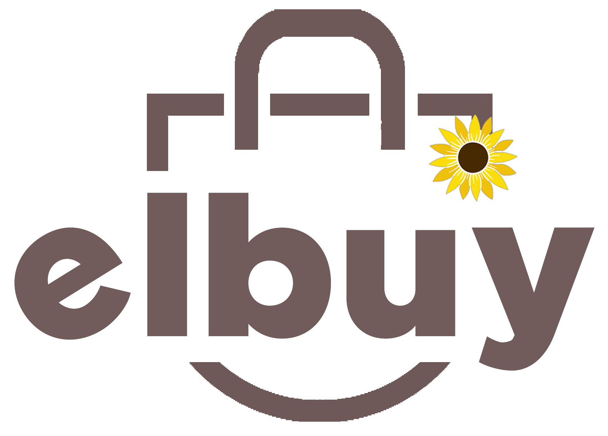

<pre>
</pre>

<!-- Project Name -->

  

<!-- Project Tagline -->
<h3 align="center"> You want it? Come and thrift it! </h3>

 A Web Development Workshop Submission: Landing Page </h1>

  <strong> Project Description: </strong>
  Elbuy is a platform where people around Los Baños can buy and sell
  their new or preloved items with a secure and fast transaction. Through
  this platform we can help other people to find affordable items within
  ELBI and also give them a chance to earn money by selling second-hand items.

<pre align="center">
@authors: Alexandria Ferrer, Janelle Mangalao, Ralph Rea, France Ureta
@group-number: 4

@date-started: July 2022
</pre>
